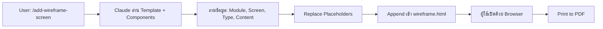

# Wireframe System - คู่มือการใช้งาน

ระบบสร้าง UI/UX Wireframes แบบ HTML+CSS สำหรับออกแบบหน้าจอก่อนเขียนโปรแกรม

---

## 📋 สารบัญ

- [ภาพรวม](#ภาพรวม)
- [โครงสร้างไฟล์](#โครงสร้างไฟล์)
- [หลักการออกแบบ](#หลักการออกแบบ)
- [วิธีการใช้งาน](#วิธีการใช้งาน)
- [Screen Types](#screen-types)
- [Components Reference](#components-reference)
- [Best Practices](#best-practices)
- [FAQ](#faq)

---

## ภาพรวม

Wireframe System เป็นระบบสร้างเอกสาร UI/UX Wireframes แบบ Static HTML ที่:

✅ **ใช้ HTML+CSS เท่านั้น** - ไม่มี JavaScript, ไม่มี event handlers
✅ **จำลอง Modal/Dialog** - ใช้ `position: absolute` จำลอง UI
✅ **ภาษาไทยเป็นหลัก** - ทุกข้อความเป็นภาษาไทย
✅ **รองรับการ Print** - แต่ละหน้าจอแยกหน้าอย่างถูกต้อง (A4 Landscape)
✅ **ประหยัด Token** - ใช้ template + placeholders แทนการ copy-paste ทั้งหมด

---

## โครงสร้างไฟล์

```
docs/wireframes/
├── wireframe.html              # ไฟล์หลัก (รวมทุก screens สำหรับ print)
├── _template_screen.html       # Template สำหรับ Claude (with placeholders)
├── _components.md              # Components reference (Navbar, Sidebar, Modal, etc.)
└── README.md                   # เอกสารนี้
```

### 1. `wireframe.html`
- ไฟล์หลักที่รวม **ทุกหน้าจอ** ไว้ในไฟล์เดียว
- มี **Header Page** (หน้าปก) อยู่แล้ว
- เมื่อใช้คำสั่ง `/add-wireframe-screen` จะ **append หน้าจอใหม่** เข้าไปก่อน `</body>`
- เปิดด้วย browser แล้วกด **Print** (Ctrl+P / Cmd+P) ได้เลย

### 2. `_template_screen.html`
- Template สำหรับ Claude ใช้สร้างหน้าจอใหม่
- มี **placeholders** เช่น `{{MODULE_TITLE}}`, `{{CONTENT}}`, `{{MODAL}}`
- ขนาดเล็ก (~1KB) ทำให้ประหยัด token มาก

### 3. `_components.md`
- เก็บ HTML snippets ของ components ที่ใช้ซ้ำ
- Navbar, Sidebar, Modal, Form Fields, Table, etc.
- Claude อ่านไฟล์นี้เพื่อดึง components มาใช้

---

## หลักการออกแบบ

### 🎯 หลักการสำคัญ

#### 1. **Static HTML เท่านั้น**
```html
<!-- ✅ ถูกต้อง: Static button -->
<button class="px-4 py-2 bg-blue-600 text-white rounded">บันทึก</button>

<!-- ❌ ผิด: มี event handler -->
<button onclick="save()">บันทึก</button>
```

#### 2. **จำลอง Modal ด้วย position: absolute**
```html
<!-- Modal Overlay - ไม่ใช่ modal จริง -->
<div style="position: absolute; top: 0; left: 0; width: 100%; height: 100%; background-color: rgba(0, 0, 0, 0.5);">
    <div class="bg-white rounded-lg shadow-xl" style="width: 600px;">
        <!-- Modal content -->
    </div>
</div>
```

#### 3. **ภาษาไทย 100%**
```html
<!-- ✅ ถูกต้อง -->
<button>บันทึก</button>
<label>ชื่อผู้ใช้งาน</label>

<!-- ❌ ผิด -->
<button>Save</button>
<label>Username</label>
```

#### 4. **A4 Landscape - 1 Screen per Page**
```css
.page {
    width: 297mm;
    height: 210mm;
    page-break-after: always;
}
```

---

## วิธีการใช้งาน

### 🚀 เริ่มต้นใช้งาน

#### 1. สร้างหน้าจอใหม่ด้วย Slash Command

```bash
/add-wireframe-screen
```

Claude จะถามข้อมูล:
1. **Module Title** - ชื่อ Module (เช่น "จัดการผู้ใช้งาน")
2. **Screen Number** - หมายเลขหน้าจอ (เช่น "1.1")
3. **Screen Title** - ชื่อหน้าจอ (เช่น "หน้าแสดงรายการ")
4. **Screen Type** - ประเภทหน้าจอ:
   - `list` - หน้ารายการ (ตาราง + search/filter)
   - `modal-add` - หน้าที่มี modal เพิ่ม/แก้ไข
   - `modal-validation` - หน้า modal พร้อม validation errors
   - `modal-delete` - หน้า delete confirmation dialog
5. **Content Details** - รายละเอียดเนื้อหา (ชื่อฟิลด์, ข้อมูลตาราง, etc.)

#### 2. ดูผลลัพธ์

เปิดไฟล์ `docs/wireframes/wireframe.html` ด้วย browser:
```bash
# macOS
open docs/wireframes/wireframe.html

# Linux
xdg-open docs/wireframes/wireframe.html

# Windows
start docs/wireframes/wireframe.html
```

#### 3. พิมพ์เอกสาร

1. เปิดไฟล์ `wireframe.html` ใน browser
2. กด **Print** (Ctrl+P / Cmd+P)
3. เลือก **Landscape** orientation
4. เลือก **Save as PDF** หรือ Print ได้เลย

---

## Screen Types

### 1. **List** - หน้ารายการ

**ลักษณะ:**
- แสดงตาราง + Search/Filter
- มีปุ่ม "+ เพิ่ม"
- มี Pagination
- **ไม่มี modal**

**ตัวอย่าง Use Case:**
- หน้ารายการผู้ใช้งาน
- หน้ารายการสินค้า
- หน้ารายการคำสั่งซื้อ

**Components:**
- Navbar ✅
- Sidebar ✅
- Page Header ✅
- Search/Filter ✅
- Table ✅
- Pagination ✅
- Modal ❌

---

### 2. **Modal-Add** - Modal เพิ่ม/แก้ไข

**ลักษณะ:**
- Content ด้านหลังเบลอ (blur)
- Modal อยู่กลางจอ
- มี Form Fields
- ปุ่ม: ยกเลิก, บันทึก

**ตัวอย่าง Use Case:**
- หน้าเพิ่มผู้ใช้งานใหม่
- หน้าแก้ไขข้อมูลสินค้า
- หน้าเพิ่มคำสั่งซื้อ

**Components:**
- Navbar ✅
- Sidebar ✅
- Content (blurred) ✅
- Modal Dialog ✅
- Form Fields ✅

---

### 3. **Modal-Validation** - Modal พร้อม Validation Errors

**ลักษณะ:**
- เหมือน Modal-Add
- แต่มี **error states** ในฟิลด์
- ใช้ class `.input-error` สำหรับ input ที่ error
- แสดง error message ใต้ input

**ตัวอย่าง Use Case:**
- หน้าแสดง validation errors เมื่อกรอกข้อมูลไม่ครบ
- หน้าแสดง error เมื่อข้อมูลซ้ำ

**Components:**
- Navbar ✅
- Sidebar ✅
- Content (blurred) ✅
- Modal Dialog ✅
- Form Fields with Errors ✅

**Error State:**
```html
<input type="text" class="w-full px-3 py-2 text-sm border border-gray-300 rounded input-error">
<div class="error-message">กรุณากรอกชื่อผู้ใช้งาน</div>
```

---

### 4. **Modal-Delete** - Delete Confirmation Dialog

**ลักษณะ:**
- Dialog เล็กกว่า (width: 450px)
- มีไอคอน warning ⚠️
- ข้อความยืนยันการลบ
- ปุ่ม: ยกเลิก (gray), ลบข้อมูล (red)

**ตัวอย่าง Use Case:**
- หน้ายืนยันลบผู้ใช้งาน
- หน้ายืนยันลบสินค้า
- หน้ายืนยันลบคำสั่งซื้อ

**Components:**
- Navbar ✅
- Sidebar ✅
- Content (blurred) ✅
- Delete Dialog ✅

---

## Components Reference

### 🧭 Navbar
- แสดงชื่อระบบ: **"Web Admin Base"**
- แสดงชื่อผู้ใช้: **"ผู้ดูแลระบบ"**
- Avatar: **"ผด"**

### 📂 Sidebar
เมนูหลัก:
- 🏠 หน้าหลัก
- 📊 จัดการข้อมูล
- 📈 รายงาน
- ⚙️ ตั้งค่า

### 📄 Content Components
- Page Header (หัวข้อหน้า + Breadcrumb)
- Search/Filter Bar
- Data Table
- Pagination
- Status Badges

### 🗂️ Modal Components
- Modal Overlay (rgba(0,0,0,0.5))
- Modal Dialog
- Modal Header
- Modal Body (Form Fields)
- Modal Footer (Buttons)

### 📝 Form Components
- Text Input
- Number Input
- Date Input
- Select Dropdown
- Textarea
- Validation Error State

ดูรายละเอียดเต็มได้ที่: [_components.md](wireframes/_components.md)

---

## Best Practices

### ✅ Do's

1. **ใช้ภาษาไทยทั้งหมด** - ทุกข้อความ ยกเว้น technical terms
2. **ใช้ Tailwind CSS** - สำหรับ styling ทั้งหมด
3. **ใช้ Components จาก _components.md** - อย่า reinvent the wheel
4. **แต่ละหน้าจอแยกกัน** - อยู่ใน `<div class="page screen-page">` ของตัวเอง
5. **ระบุ Screen Number ชัดเจน** - เช่น 1.1, 1.2, 2.1 (ตามลำดับ)
6. **จำลอง Modal ด้วย position: absolute** - ไม่ใช่ modal จริง
7. **ใช้ Template + Placeholders** - ประหยัด token
8. **Test การ Print** - ตรวจสอบว่าแต่ละหน้าแยกกันถูกต้อง

### ❌ Don'ts

1. **ห้ามใช้ JavaScript** - ไม่มี `<script>`, ไม่มี event handlers
2. **ห้ามใช้ modal/dialog จริง** - ใช้ position: absolute จำลอง
3. **ห้ามมี scrolling ใน screenview** - ใช้ `overflow: hidden`
4. **ห้ามใช้ภาษาอังกฤษ** - ยกเว้น technical terms (Button, Input, etc.)
5. **ห้าม copy-paste ทั้งหมด** - ใช้ template แทน
6. **ห้าม inline ทุกอย่าง** - ใช้ Tailwind classes ให้มากที่สุด

---

## Token Usage Comparison

| วิธีการ | Token Usage | ไฟล์ที่อ่าน |
|---------|-------------|------------|
| ❌ อ่านไฟล์ทั้งหมด (เหมือนตัวอย่าง) | ~70,000 tokens | wireframe.html (289KB) |
| ✅ ใช้ Template System (ระบบนี้) | ~2,500 tokens | _template_screen.html + _components.md (~10KB) |
| **ประหยัด** | **~96%** | **~280KB** |

---

## Workflow Summary



---

## FAQ

### Q: ทำไมต้องใช้ Template + Placeholders?
A: เพื่อ**ประหยัด token มหาศาล** (96%) และ**ง่ายต่อการ maintain** - แก้ template ที่เดียว ไม่ต้องแก้ทุกหน้า

### Q: ทำไมไม่ใช้ JavaScript?
A: เพราะเป็น **Wireframe สำหรับออกแบบ UI** ไม่ใช่โปรแกรมจริง - ไม่ต้องการ functionality แค่ต้องการ**แสดง UI Layout** เท่านั้น

### Q: Modal จำลองด้วย position: absolute ได้จริงเหรอ?
A: ได้ครับ! ใช้ `position: absolute` + `z-index` วาง Modal ทับบน Content + เพิ่ม Overlay (rgba) ได้เหมือนของจริง

### Q: ถ้าต้องการแก้ไข Navbar/Sidebar ทำไง?
A: แก้ไขใน `_components.md` แล้วสร้างหน้าจอใหม่ - หรือถ้าต้องการแก้หน้าเก่า ต้องแก้ใน `wireframe.html` ตรงๆ

### Q: Print ออกมาแล้วหน้าไม่แยกกัน?
A: ตรวจสอบว่า:
1. ใช้ `page-break-after: always` ใน `.page`
2. เลือก **Landscape** orientation ตอน print
3. ปิด "Headers and footers" ใน print settings

### Q: ถ้าต้องการเพิ่ม Screen Type ใหม่ (เช่น Dashboard)?
A: เพิ่มใน `_components.md` และอัปเดต command ใน `.claude/commands/add-wireframe-screen.md`

### Q: Wireframe นี้ใช้สำหรับอะไร?
A:
- ✅ ออกแบบ UI ก่อนเขียนโปรแกรม
- ✅ สื่อสารกับทีม/ลูกค้าเกี่ยวกับ UI
- ✅ สร้างเอกสาร Specification
- ✅ เก็บไว้เป็น Design Reference
- ❌ ไม่ใช่สำหรับ Production Code

### Q: แก้ไข wireframe.html ตรงๆ ได้ไหม?
A: ได้ครับ! ถ้าต้องการปรับแต่งหน้าจอที่สร้างไว้แล้ว สามารถแก้ไฟล์ `wireframe.html` ได้โดยตรง

---

## ตัวอย่างการใช้งาน

### ตัวอย่างที่ 1: สร้างหน้ารายการผู้ใช้งาน

```bash
/add-wireframe-screen
```

**คำถาม:**
- Module Title: `จัดการผู้ใช้งาน`
- Screen Number: `1.1`
- Screen Title: `หน้าแสดงรายการผู้ใช้งาน`
- Screen Type: `list`
- Content Details:
  - ตารางแสดง: ชื่อ, อีเมล, บทบาท, สถานะ
  - Filter: ทั้งหมด, ใช้งาน, ระงับ
  - ปุ่ม: + เพิ่มผู้ใช้งาน

**ผลลัพธ์:** หน้าจอรายการพร้อมตาราง + search/filter ถูกเพิ่มเข้า wireframe.html

---

### ตัวอย่างที่ 2: สร้างหน้า Modal เพิ่มผู้ใช้งาน

```bash
/add-wireframe-screen
```

**คำถาม:**
- Module Title: `จัดการผู้ใช้งาน`
- Screen Number: `1.2`
- Screen Title: `หน้าเพิ่มผู้ใช้งานใหม่`
- Screen Type: `modal-add`
- Content Details:
  - Form Fields: ชื่อ, นามสกุล, อีเมล, รหัสผ่าน, บทบาท
  - Modal Title: เพิ่มผู้ใช้งานใหม่

**ผลลัพธ์:** หน้าจอพร้อม Modal Dialog ถูกเพิ่มเข้า wireframe.html

---

### ตัวอย่างที่ 3: สร้างหน้า Validation Error

```bash
/add-wireframe-screen
```

**คำถาม:**
- Module Title: `จัดการผู้ใช้งาน`
- Screen Number: `1.3`
- Screen Title: `หน้าตรวจสอบความถูกต้อง`
- Screen Type: `modal-validation`
- Content Details:
  - Error Fields: ชื่อ (กรุณากรอกชื่อ), อีเมล (รูปแบบอีเมลไม่ถูกต้อง)

**ผลลัพธ์:** หน้าจอ Modal พร้อม validation errors ถูกเพิ่มเข้า wireframe.html

---

## การอัปเดตเอกสาร

เมื่อมีการเปลี่ยนแปลง Wireframe:

1. อัปเดตไฟล์ `wireframe.html`
2. ถ่าย screenshot หน้าจอที่เปลี่ยน (ถ้าต้องการ)
3. Commit changes:
```bash
git add docs/wireframes/
git commit -m "docs: update wireframe - เพิ่มหน้าจอ [ชื่อหน้าจอ]"
```

---

## Resources

- [Tailwind CSS Documentation](https://tailwindcss.com/docs)
- [_components.md](wireframes/_components.md) - Components Reference
- [_template_screen.html](wireframes/_template_screen.html) - Screen Template
- [wireframe.html](wireframes/wireframe.html) - Main Wireframe File

---

## Contact

หากมีคำถามหรือข้อเสนอแนะเกี่ยวกับ Wireframe System:
- สร้าง Issue ใน GitHub
- ติดต่อ Dev Team
- แก้ไขเอกสารและส่ง Pull Request

---

**Last Updated**: 2025-11-13
